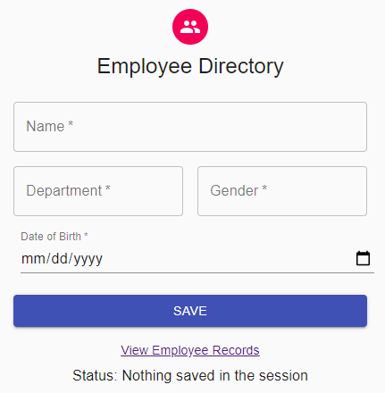
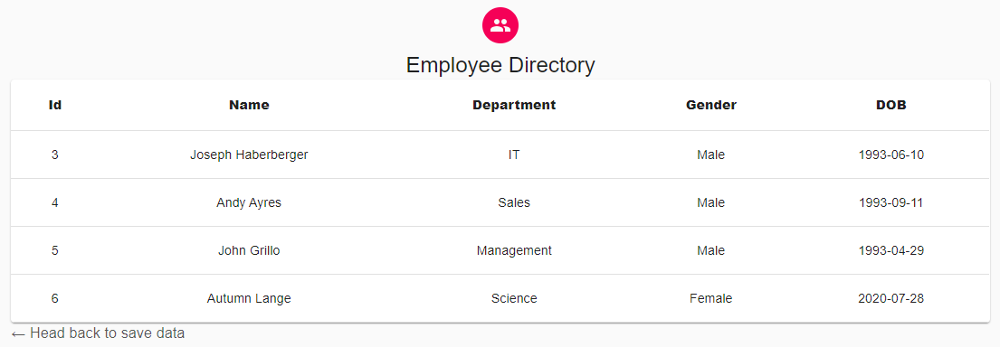

# JavaSpringReact

##	Overview
Git project is meant for practicing Java Spring Boot and building a React UI for API Server integration.
The project uses [Gradle](https://docs.gradle.org/current/userguide/what_is_gradle.html) build automation tool.

 

### Set Up:
Use Docker (Linux or "For Windows") to stand up container for POSTGRES database:

`docker run -p 5432:5432 --name psql2 -e POSTGRES_USER=postgres -e POSTGRES_PASSWORD=postgres -e POSTGRES_DB=postgres -v pgdata:/var/lib/postgresql/data -d postgres`

Connect to your new DB Container using DBeaver, SQLSquirrel, or some other DB tool:

Connection Info:
- **Name**: enter_name_here
- **Driver**: [PostgreSQL](https://jdbc.postgresql.org/)
- **URL**: jdbc:postgresql://localhost:5432/postgres
- **username**: postgres
- **password**: postgres
